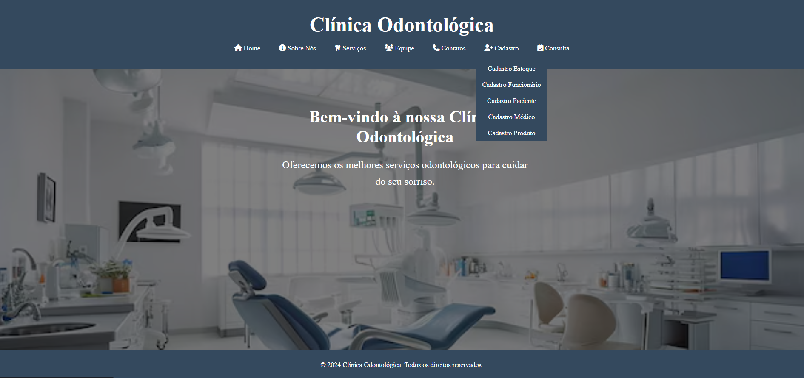
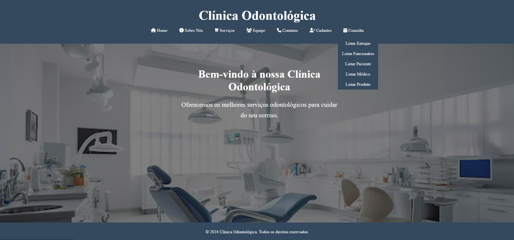
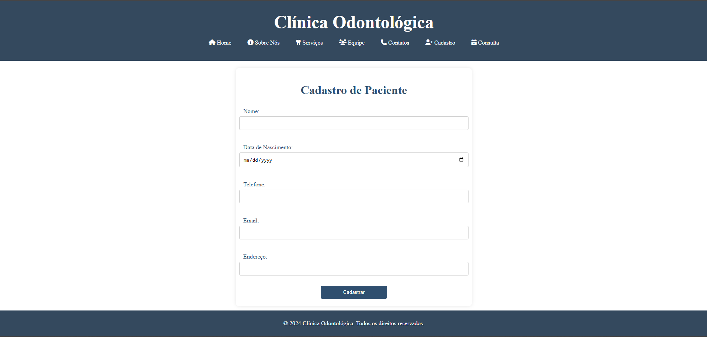
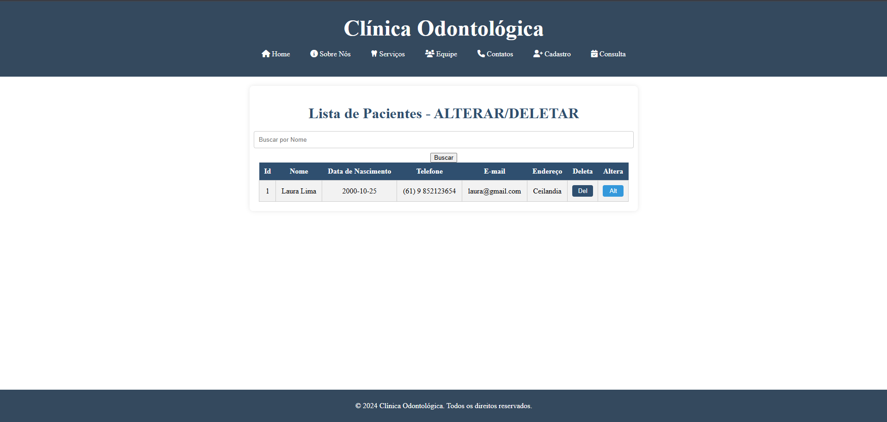
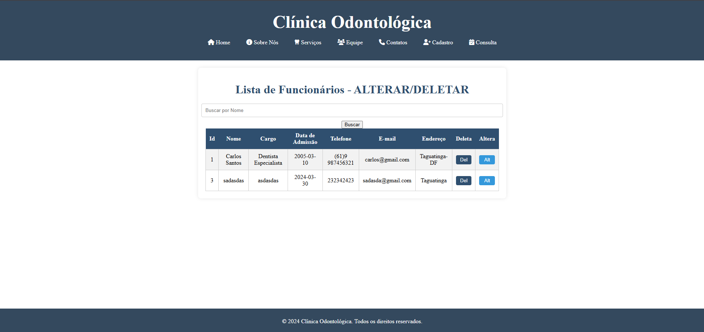
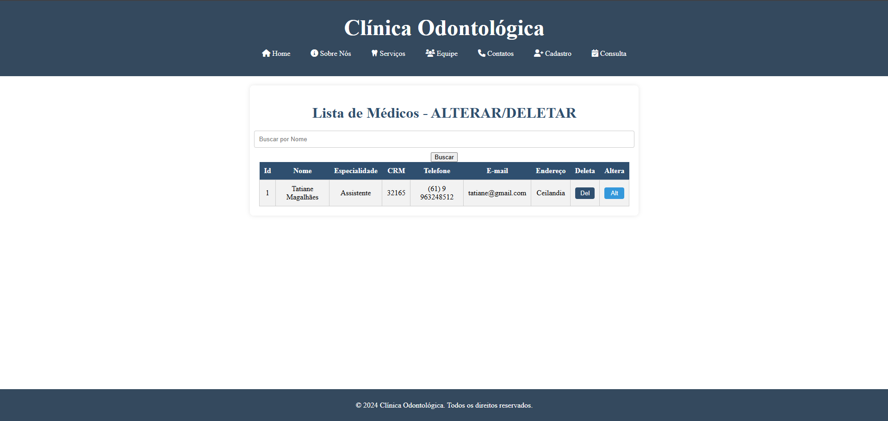
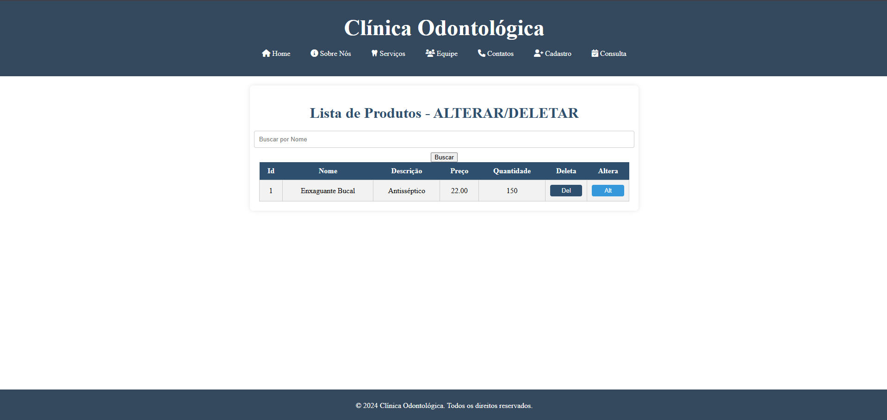

# 🏥 Clinica Odontológica - Sistema de Cadastro(Funcionários/Pacientes/Médicos/Produtos) e Gerenciamento de Estoque


---

## 📚 Finalidade

Este projeto foi desenvolvido como **projeto acadêmico**, atividade **avaliativa**, no **Curso Técnico em Informática**, com o objetivo de praticar:

* Desenvolvimento Full Stack (front-end e back-end).
* Integração com banco de dados relacional.
* Estruturação e manipulação de formulários.

---

## ✅ Funcionalidades

* 📋 Cadastro de pacientes com dados pessoais.
* 👩‍💼 Cadastro de funcionários com informações profissionais.
* 📦 Cadastro de produtos com detalhes técnicos.
* 🥼 Cadastro de médicos com informações profissionais.
* 📝 Gerenciamento de Estoque.
* 🗄️ Armazenamento e manipulação de dados via **MySQL**.
* 🔄 Funcionalidades **CRUD** para clientes, funcionários e produtos:
  * **Listar** registros cadastrados.
  * **Editar** informações existentes.
  * **Deletar** registros indesejados.
* 🖥️ Interfaces simples e funcionais para interação com o sistema.

---

## 🛠️ Tecnologias utilizadas

* HTML5, CSS3
* PHP (com MySQLi)
* MySQL

---

## 🚀 Como executar o projeto

1. Clone este repositório:

```bash
   git clone https://github.com/seu-usuario/projeto_clinicaodontologica.git
```

2. Configure o servidor local (**XAMPP**).

3. Execute o script SQL para criar o banco de dados e as tabelas:

```sql
CREATE DATABASE IF NOT EXISTS clinicaodontologica;
USE clinicaodontologica;

CREATE TABLE `estoque` (
  `id` INT AUTO_INCREMENT PRIMARY KEY,
  `produto_id` int(11) NOT NULL,
  `quantidade` int(11) NOT NULL,
  `data_entrada` date NOT NULL
) ENGINE=InnoDB DEFAULT CHARSET=utf8 COLLATE=utf8_general_ci;

CREATE TABLE `funcionarios` (
  `id` INT AUTO_INCREMENT PRIMARY KEY,
  `nome` varchar(200) NOT NULL,
  `cargo` varchar(100) NOT NULL,
  `data_admissao` date NOT NULL,
  `telefone` varchar(16) NOT NULL,
  `email` varchar(200) NOT NULL,
  `endereco` varchar(200) NOT NULL
) ENGINE=InnoDB DEFAULT CHARSET=utf8 COLLATE=utf8_general_ci;

CREATE TABLE `medicos` (
  `id` INT AUTO_INCREMENT PRIMARY KEY,
  `nome` varchar(200) NOT NULL,
  `especialidade` varchar(100) NOT NULL,
  `crm` varchar(20) NOT NULL,
  `telefone` varchar(16) NOT NULL,
  `email` varchar(200) NOT NULL,
  `endereco` varchar(200) NOT NULL
) ENGINE=InnoDB DEFAULT CHARSET=utf8 COLLATE=utf8_general_ci;

CREATE TABLE `pacientes` (
  `id` INT AUTO_INCREMENT PRIMARY KEY,
  `nome` varchar(200) NOT NULL,
  `data_nascimento` date NOT NULL,
  `telefone` varchar(16) NOT NULL,
  `email` varchar(200) NOT NULL,
  `endereco` varchar(200) NOT NULL
) ENGINE=InnoDB DEFAULT CHARSET=utf8 COLLATE=utf8_general_ci;

CREATE TABLE `produtos` (
  `id` INT AUTO_INCREMENT PRIMARY KEY,
  `nome` varchar(200) NOT NULL,
  `descricao` varchar(200) NOT NULL,
  `preco` decimal(10,2) NOT NULL,
  `quantidade` int(11) NOT NULL
) ENGINE=InnoDB DEFAULT CHARSET=utf8 COLLATE=utf8_general_ci;
```

4. Coloque os arquivos do projeto na pasta `htdocs` (caso use **XAMPP**).

5. Acesse via navegador:

```
http://localhost/projeto_clinicaodontologica
```

---

## 📸 Prints do Sistema

### 🖼️ Tela Inicial






### 🖼️ Tela de cadastro de Pacientes



### 🖼️ Tela de Listar de Pacientes



### 🖼️ Tela de Listar de Funcionários



### 🖼️ Tela de Listar de Médicos



### 🖼️ Tela de Listar de Produtos



### 🖼️ Tela de Listar de Estoque


---

## 🤝 Contribuição

Projeto desenvolvido por **Angelita Luz** durante o **Curso Técnico em Informática**.

---
